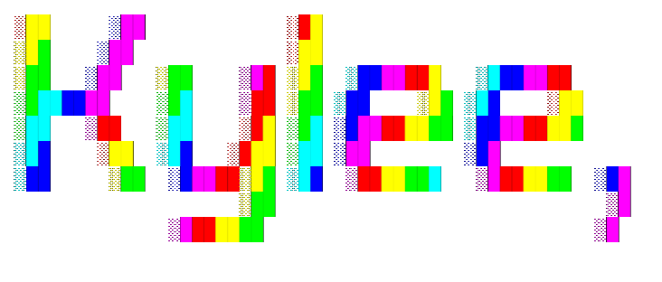

 

 

I build web and mobile tools for students. The kind that do one thing, load fast and do not ask you to make an account first. I reach for a framework when a project earns it and keep things plain when it doesn't.

 

### Tech

**Frontend**

**Mobile & cross-platform**

**Backend & APIs**

**Data & cloud**

**AI & LLM tooling**

**Tooling & workflow**

**Also write**

 

### Projects

| | What it does | Live |
|---|---|---|
| **[Planora](https://github.com/kkyleee23/Planora-Official)** | Task manager for Android and web with a built-in AI assistant. No accounts, no ads, works offline, under 5&nbsp;MB. | [planora-official.vercel.app](https://planora-official.vercel.app) |
| **[PrintScreen](https://github.com/kkyleee23/PrintScreen)** | Turns a PDF, PPTX, DOCX, XLSX or image into a structured reviewer: summaries, flashcards, quizzes and key terms. Built on GroqCloud. | [printscreen.onrender.com](https://printscreen.onrender.com) |
| **[Studs](https://github.com/kkyleee23/Studs)** | Student–teacher management that runs outside your school's LMS. | In progress |

 

Apalit, Pampanga · BSIT @ STI College Malolos

